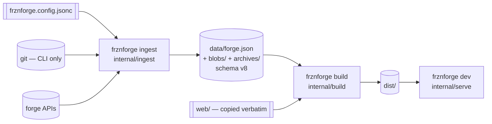

# Developer docs

Notes for working *on* frznforge. If you are trying to publish a site with it, start at
[docs/user/](../user/README.md) instead.

Since 0.4.0 the engine is **one Go binary**. `go build ./cmd/frznforge` produces it; there is no
Node in the build path and no bundler, transpiler or minifier anywhere. Node is needed only to run
the Playwright suite.

| Guide | |
|---|---|
| [Architecture](./architecture.md) | The package layout, the three invariants the build rests on, and the audit mapping every deleted vitest file to its Go replacement |
| [Build steps](./build-steps.md) | What `frznforge build` does, step by step: ingest, the remote path and its four skips, the artifact, the render |
| [Data model](./data-model.md) | `forge.json` — the ingest ↔ site contract, and the rules for changing it |
| [Build performance](./performance.md) | Where the time and the bytes go, measured, plus the knobs and the ideas that were rejected |
| [Release checklist](./release-checklist.md) | What to run and check before cutting a version |
| [Plans](./plans/) | Phase plans and the cross-cutting rules each version is held to |

## The shape of it



The artifact is the seam, and it is the reason the two halves can be reasoned about separately:
left of it, code reads the world; right of it, code is a pure function of a file.
[architecture.md](./architecture.md#the-three-invariants) is where that is spelled out.

## House rules

- **`internal/model` is the boundary between ingest and the site.** Any change to it bumps
  `SchemaVersion` (`internal/model/model.go:44`) and updates
  [data-model.md](./data-model.md#bumping-schemaversion) and the fixtures, in the same change.
  Declaration order *is* the artifact's key order, so reordering two struct fields is a schema
  change.
- **`internal/ingest/*` reads git through the CLI only, never the working tree.** This is the
  load-bearing invariant of the project — every other guarantee rests on it — and
  `internal/ingest/uncommitted_test.go:26` is what guards it.
- **Determinism is not an aspiration.** Never range a Go map without sorting the keys, never use a
  locale-aware comparison, never read the clock — take `now time.Time` as a parameter. Two
  machines must emit identical bytes from identical input, and
  `internal/build/determinism_test.go:32` plus `internal/build/parallel_test.go:22` are the gates.
- **`web/` is served verbatim**: plain ES modules, no transpile, no bundler, relative imports
  carrying their `.js` extension. `web/js/{format,listing,search,base}.js` are THE
  implementations — never fork one into a second copy, and never import node or config from them,
  because a browser loads them as written. `web/vendor/` is pre-built third-party code (mermaid),
  served as published — nothing in this repository compiles or bundles it.
- **The two-language golden rule.** `web/js/{format,listing}.js` and their Go twins
  (`internal/render/format.go:14-22`, `internal/render/listing.go:12-18`) are a genuine pair: the
  same logic has to run in Go at build time and in a browser when a visitor touches a filter, and
  a divergence changes the listing the instant somebody interacts with it. They are pinned by
  `tests/fixtures/{format,listing}-cases.json`, which are generated **from the JavaScript** —
  making the JavaScript the reference and Go the thing checked against it. **Change either `.js`
  file and re-run its generator in the same commit.** Each fixture records the sha256 of the file
  it came from, and `internal/render/golden_test.go:27` re-hashes it and fails with the exact
  command:

  ```sh
  node tests/fixtures/gen-format-cases.mjs
  node tests/fixtures/gen-listing-cases.mjs
  ```

  A snapshot is only as current as the last person who regenerated it. Without that hash, editing
  the JavaScript and skipping the regeneration leaves Go agreeing with the old behaviour while the
  browser ships the new — the precise divergence the fixture exists to catch, hidden by the fixture
  itself.
- **Comments explain why, not what.** Name the bug the code prevents, the alternative rejected, or
  the invariant at stake. A comment that restates the next line is worse than none.
- **Plain CSS only**, `hf-` prefix, tokens at the top of `web/css/global.css` (site-wide) and
  `web/css/repo.css` (repo sub-pages). No Tailwind, no Sass.
- **Usability beats accessibility when the two collide.** This is a personal app.
- `go test ./internal/... ./cmd/...` and `npm run test:e2e` both stay green, and no test touches
  the network.

## The commands

```sh
go build ./cmd/frznforge     # the engine
go build ./cmd/frzndebugger  # the run-log / timings viewer

frznforge ingest             # git + forge APIs → data/forge.json, data/blobs/, data/archives/
frznforge build              # ingest, then render → dist/
frznforge build --no-ingest  # render the artifact on disk; the loop while editing templates or CSS
frznforge dev                # serve the last build; rebuilds nothing
```

There is no watch mode and no HMR. The render is fast enough that a rebuild *is* the loop: a
one-repository site renders in under two seconds, and `--no-ingest` skips the half that talks to
git and the network (`cmd/frznforge/main.go:290`). `frznforge dev` renders nothing and watches
nothing, and says so on startup rather than letting you find out (`internal/serve/notice.go`).

`--no-ingest` refuses when there is no artifact (`cmd/frznforge/main.go:349`) instead of quietly
building an empty site over a good one.

## Testing

- `go test ./internal/... ./cmd/...` — the whole engine, with fixture git repositories in temp
  dirs. **Scoped on purpose**, not by accident: a built site under `dist/` contains the raw source
  files of every repository it publishes, so a corpus with Go repos in it puts hundreds of stray
  `.go` files inside this module and `./...` tries to parse them. Build the site somewhere the Go
  tool ignores — `frznforge build --out=_dist` — if you want `./...` back.
- The heavy gates are opt-in. `FRZNFORGE_FULL_CORPUS=1 go test ./internal/build/ -timeout 90m`
  renders your own corpus twice to prove determinism and serial/parallel agreement; without it the
  same tests run against a fixture they build themselves (`internal/build/sync_test.go:394`), which
  is what keeps them honest on a clean clone.
- `npm run test:e2e` — Playwright, the one suite that needs Node and a browser.
  `tests/e2e/global-setup.ts` builds fixture repositories, seeds the provider caches so the two
  "remote" repos import offline, runs the binary for ingest and build, then starts two
  `frznforge dev` servers.
- **The e2e specs may not be edited to accommodate an engine change.** They are the invariant the
  0.4.0 rewrite was measured against; the harness around them may change, the assertions may not.
- There is **no `npm run check`.** 0.4.0 removed TypeScript rather than upgrading it — Playwright
  transpiles its own specs, and `tsconfig.json` exists for editors only.

## Diagnostics

Every run of `build`, `ingest` and `dev` leaves evidence in `<ingest.outDir>`, whether or not
anybody asked for it:

| File | |
|---|---|
| `frznforge.log` | what the last run did, at debug, truncated per run (`internal/logging/file.go:34`) |
| `frznforge-timings.jsonl` | what each step cost, one JSON object per line, appended (`internal/timings/timings.go:1`) |

`frzndebugger` reads both — a TUI by default, `--web` for a browser, `--plain` for a script — and
leads with **steps that started and never finished**, which is the answer when a run stops.

`--log=<error|warn|info|debug>` (or `FRZNFORGE_LOG`) adds a stderr sink on any command:
`frznforge build --log=debug 2> build.log`. Every git call, HTTP request, subprocess, lock and
worker-pool slot is recorded *before* it starts as well as after it finishes, so a command that
never returns leaves a start record with no matching finish — and that asymmetry names the culprit.
It is off by default and costs one comparison per call site when off.
