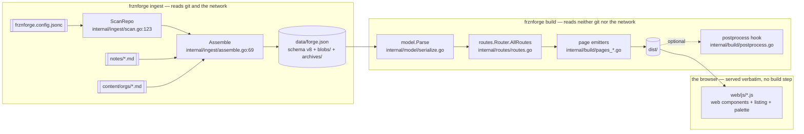

# Architecture

> Written for 0.4.0, the version that replaced the Astro/TypeScript build with a single Go
> binary. The parts of this document that describe the Go layout are filled in by Phase 10; what
> is here now is the piece Phase 9 owes: **the test coverage audit**.

## The pipeline

The artifact is the seam. Everything left of it reads the world; everything right of it is a pure
function of the file. That is what makes the build reproducible, and it is why the tests below
split so cleanly into "does ingest read git correctly" and "does the build render the artifact
correctly".

---

## Test coverage audit

0.3.0 had **42 vitest files** covering the TypeScript. 0.4.0 deletes the TypeScript, so every one
of them had to go somewhere. This table is the accounting, and it is deliberately unflattering:
the plan named this as "the single most likely place for this version to lose something", so a
row that says *partial* or *gap* is more useful here than a row that says *done*.

Status key — **✅ ported**, **◐ partial** (named below), **⊘ obsolete** (the thing it tested no
longer exists). Every row is now settled; nothing is outstanding.

### Ingest — reads git through the CLI, never the working tree

| vitest file | Go replacement | |
|---|---|---|
| `uncommitted.test.ts` | `internal/ingest/uncommitted_test.go` | ✅ |
| `ingest.test.ts` | `internal/ingest/scan_test.go`, `assemble_test.go` | ✅ |
| `commits.test.ts` | `internal/ingest/commits_test.go` | ✅ |
| `contributors.test.ts` | `internal/ingest/contributors_test.go` | ✅ |
| `refs.test.ts` | `internal/ingest/refs_test.go` | ✅ |
| `scan-refs.test.ts` | `internal/ingest/refs_test.go`, `scan_test.go` | ✅ |
| `tree.test.ts` | `internal/ingest/tree_test.go` | ✅ |
| `languages.test.ts` | `internal/ingest/languages_test.go` | ✅ |
| `license.test.ts` | `internal/ingest/license_test.go` | ✅ |
| `meta.test.ts` | `internal/ingest/meta_test.go` | ✅ |
| `insights.test.ts` | `internal/ingest/insights_test.go` | ✅ |
| `notes.test.ts` | `internal/ingest/notes_test.go` | ✅ |
| `orgs.test.ts` | `internal/ingest/orgs_test.go` | ✅ |
| `hosting.test.ts` | `internal/ingest/hosting_test.go` | ✅ |
| `importers.test.ts` | `internal/ingest/importers_test.go`, `importers_parity_test.go` | ✅ |
| `remote.test.ts` | `internal/ingest/remote_test.go` | ✅ |
| `backoff.test.ts` | `internal/ingest/backoff_test.go` | ✅ |
| `reuse.test.ts` | `internal/ingest/reuse_test.go` | ✅ |
| `branch-cap.test.ts` | `internal/ingest/scan_test.go` (`TestScanRepoCapWarnings`, `TestScanRepoHostedBranchIsExemptFromTheCap`), `identity_test.go` | ◐ |
| `empty-states.test.ts` | `internal/ingest/scan_test.go` (`TestScanRepoEmpty`), `assemble_test.go` (`TestAssembleEmptyInputIsAValidArtifact`), `internal/build/sync_test.go` | ✅ |

### The artifact and the routes

| vitest file | Go replacement | |
|---|---|---|
| `schema.test.ts` | `internal/model/model_test.go` | ✅ |
| `repo-path-encoding.test.ts` | `internal/routes/routes_test.go` | ✅ |
| `site-sync.test.ts` | `internal/build/sync_test.go` | ✅ |
| `phase3-sync.test.ts` | `internal/build/sync_test.go`, `internal/build/routes_emitted_test.go` | ✅ |
| `phase6-sync.test.ts` | `internal/build/sync_test.go` | ✅ |
| `base-path.test.ts` | `internal/config/config_test.go`, `internal/routes/routes_test.go`, `tests/e2e/base-path.spec.ts` | ◐ |
| `config-knobs.test.ts` | `internal/config/config_test.go` (`TestMatchesTypeScriptDefaults`) | ✅ |

### Rendering

| vitest file | Go replacement | |
|---|---|---|
| `markdown.test.ts` | `internal/markdown/markdown_test.go`, `adhoc_xss_test.go` | ✅ |
| `phase34-libs.test.ts` | `internal/routes/routes_test.go` (slugs, routes), `internal/highlight/highlight_test.go` (language mapping), `internal/build/profile_test.go` (contributions, activity), `internal/build/search_index_test.go` (index) | ✅ |
| `search.test.ts` | `internal/build/search_index_test.go` — **index only** | ◐ |
| `format.test.ts` | `internal/render/format_test.go` + `golden_test.go` | ◐ |
| `listing.test.ts` | `internal/render/listing_test.go` + `golden_test.go` | ◐ |
| `contrast.test.ts` | `internal/theme/contrast_test.go` | ✅ |
| `assets.test.ts` | `internal/theme/assets_test.go` | ✅ |
| `heat-sync.test.ts` | — | ⊘ |
| `highlight-cache.test.ts` | — | ⊘ |

### The CLI surface

| vitest file | Go replacement | |
|---|---|---|
| `scaffold.test.ts` | `internal/scaffold/{scaffold,build,command}_test.go` — 37 | ✅ |
| `cli.test.ts` | `cmd/frznforge/{cli,dispatch,entries,flags,init,listing,select}_test.go` — 129 | ✅ |
| `build-script.test.ts` | `cmd/frznforge/build_test.go` | ✅ |
| `dev-script.test.ts` | `internal/serve/{serve,mime,notice}_test.go` — 34 | ✅ |
| `config-edit.test.ts` | `internal/wizard/edit_test.go` | ✅ |
| `web-init.test.ts` | `internal/wizard/{server,settings,scaffolded}_test.go` — 97 with the above | ✅ |

---

## The gaps, named

### 1. Browser search ranking had no coverage that survives Node — closed

`web/js/search.js` holds `scoreDoc` and `search` — what is matchable and what outranks what.
Nothing in Go ports them, because nothing server-side ranks: `internal/build/search_index_test.go`
covers the **index** the browser downloads, not the **query** it runs against it.

`tests/unit/search.test.ts` has 18 tests on that ranking. The Playwright suite exercises the
palette's behaviour (`tests/e2e/phase4.spec.ts:33`) — it opens, it finds a repo, the keyboard
works — but it asserts nothing about ordering, so a ranking regression would ship.

**Closed in Phase 9** by `tests/e2e/browser-js.spec.ts` — 21 tests, run in a real browser against
the exact files the server serves. That is better coverage than the unit runner gave them, and it
costs no dependency the version was not already keeping.

It also ended up stronger than the vitest tests it replaces. Under vitest, `buildSearchIndex` and
`scoreDoc` were two functions in one language and one test called both, so the producer and the
consumer were coupled for free. In 0.4.0 the producer is Go and the consumer is JavaScript, and
nothing was standing between them. The spec's last three tests fetch the real emitted
`/search-index.json` and assert what must hold for any index: every document is rankable, every
repository is first for its own name, and every result points at a page that exists.

Two defects surfaced immediately:

- **`web/js/search.js` dropped documents of an unknown kind.** `score += KIND_BONUS[doc.kind]` is
  `undefined` for a kind not in the table, so the score became `NaN` — and `search` keeps a
  document only when `score > 0`, which is false for `NaN`. The document did not rank last, it
  vanished, with nothing logged. Harmless while one file built the index and another read it;
  a live risk now that a kind can be added on the Go side alone. Fixed, and pinned by a test.
- **The dead-URL test is red against the Astro engine**, on exactly `docs/c#-tips.md` and
  `docs/50% off.txt`. That is the palette-404 bug already fixed in the Go build and recorded in
  the changelog, rediscovered from the browser's side. It passes under
  `FRZNFORGE_E2E_ENGINE=go` and goes green for good when Phase 9 repoints the harness.

Two smaller things were seen while reading `web/js/` and deliberately **not** changed, because
neither is a defect a visitor would notice and both alter ranking or URL output that other tests
are generated from:

- `search.js` gives an exact repository-name match a bonus large enough that nothing can displace
  it, but compares `title === query.trim().toLowerCase()` while the terms themselves are split on
  `/\s+/`. A repository named `my repo`, typed with two spaces, still matches — it just quietly
  loses the bonus the comment above it calls "wins outright".
- `listing.js`'s `toSearchParams` serialises a whitespace-only `q`, producing `?q=+++` for a query
  `matchesQuery` treats as no query at all. It round-trips correctly, so it is a URL-cleanliness
  wart rather than a bug. The whitespace behaviour it exposes *is* now pinned on both sides
  (`blankQueries` in the listing golden).

### 2. The cross-language goldens are snapshots

`web/js/format.js` and `web/js/listing.js` are pinned to their Go twins through
`tests/fixtures/{format,listing}-cases.json`, generated **from** the JavaScript. A snapshot is
only as current as the last person who regenerated it — change the JavaScript, skip the
regeneration, and Go keeps agreeing with the old behaviour while the browser ships the new.

Closed in Phase 9: each fixture now records the sha256 of the file it was generated from, and
`internal/render/golden_test.go` re-hashes and fails with the regeneration command. That catches
*staleness*. It does not replace the JavaScript's own tests — see gap 1.

### 3. Build tests that skipped without a local artifact — closed

`internal/build/{determinism,parallel,routes_emitted}_test.go` read the developer's
`data/forge.json` and called `t.Skip` when there was not one. On the clean clone Checkpoint D
requires, and on any CI runner, they printed `ok` while asserting nothing — which is
indistinguishable from passing in every summary anyone reads.

`internal/build/sync_test.go` now owns its inputs end to end: fixture git repositories, a config,
the real Go ingest, the real build. `buildRoots` in that file is what the determinism and
serial-vs-parallel gates run over, so both execute against the fixture **always** and against the
developer's own 2,107-file corpus **as well** when it happens to be there. The big corpus is far
better evidence; it just cannot be relied on to exist.

`routes_emitted_test.go` still skips, and is now redundant rather than load-bearing: `sync_test.go`
makes the same both-directions claim without skipping. It is kept because it makes it over the
real corpus.

### 4. Two tests are obsolete rather than ported

- **`heat-sync.test.ts`** read the *source* to check that every `heatFor(` and `<RepoCard` call
  site threaded `theme.heat` through, because every link in that chain had a silent default. In
  Go there is no silent default to fall through to: `render.HeatFor` takes
  `config.HeatConfig` as a required parameter (`internal/render/format.go:30`), as does
  `buildContribGraph` (`internal/build/pages_profile.go`). Forgetting to thread it is a compile
  error. The type system replaced the test.
- **`highlight-cache.test.ts`** covered `src/lib/highlight-cache.ts`, the cross-run memo that
  existed because Shiki was 84% of the render. chroma is a different order of tool and 0.4.0
  ships no memo at all (`internal/highlight/highlight.go:15` says so and why). The feature is
  gone, so its tests go with it — see `docs/dev/performance.md` for the numbers behind the call.

### 5. `branch-cap` and `base-path` are covered in pieces

Neither has a single Go file that owns it. `branchTrees` is exercised by `scan_test.go`'s cap
warnings and by `identity_test.go`, but the TypeScript test's sharpest assertion — that
`repoRoutes()` actually *shrinks* — has no direct Go equivalent; it is implied by
`sync_test.go` rather than asserted. `site.base` is covered at the config layer, at the router
layer (`routes_test.go:34` runs `AllRoutes` under both `""` and `"/mysite"`), and end to end by
`tests/e2e/base-path.spec.ts`, but no Go test builds a whole site under a base and scans the
output for leaked absolute URLs the way the e2e spec does.

Both are judged acceptable: the assertions exist, they are just distributed. Recorded here so
that is a decision rather than an oversight.
