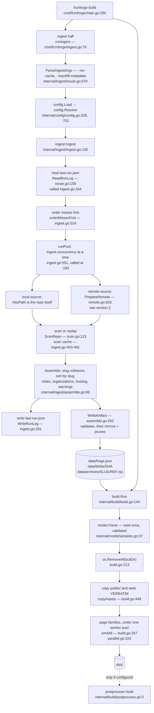
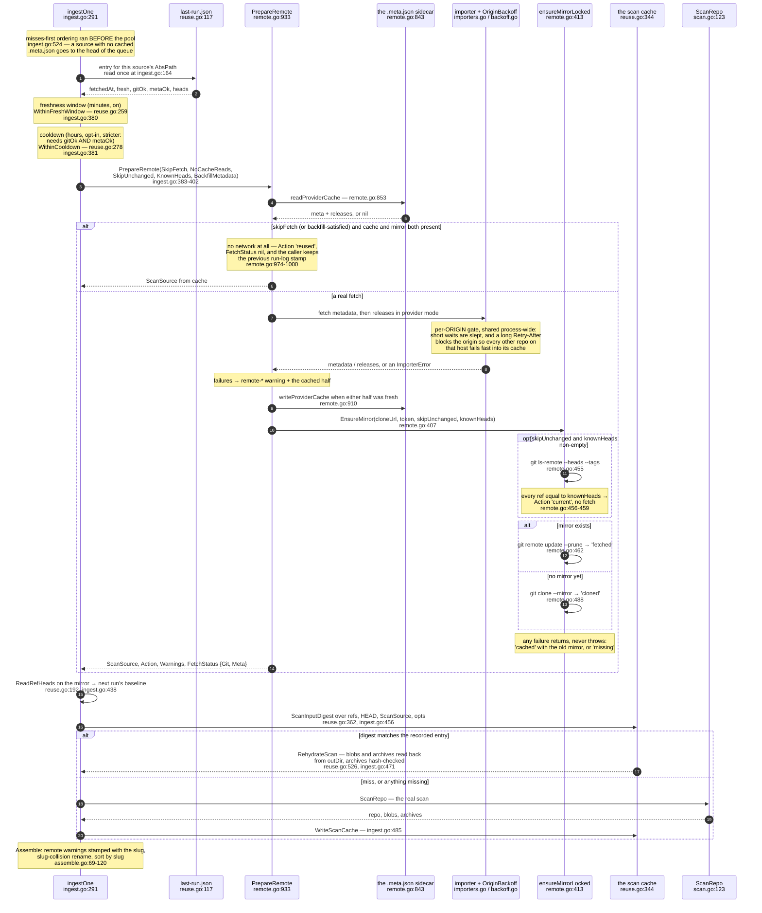

# Build steps

What `frznforge build` actually does, in order, with the file and line to read for each step.

```
frznforge build   =  one process, two halves
                     ├ ingest   git + forge APIs → data/forge.json + blobs/ + archives/
                     └ render   data/forge.json → dist/
```

Both halves live in one binary, and `build` runs them in process
(`cmd/frznforge/main.go:290`). 0.3.0's `scripts/build.ts` had to spawn `tsx scripts/ingest.ts`
and forward signals to it; a function call needs neither, which is why there is one exit code
and no shim to find on `PATH`.

`--no-ingest` renders the artifact already on disk and reads no git and no network at all. It
**refuses when there is no artifact** (`noIngestRefusal`, `cmd/frznforge/main.go:349`), because
the alternative is a build that succeeds and replaces a good `dist/` with a site containing no
repos. Passing an ingest flag alongside it is a contradiction and is also refused
(`parseBuildArgs`, `cmd/frznforge/main.go:232`) — one of the two was a mistake and silently
dropping either would be the wrong guess. Unknown flags are errors rather than being forwarded:
there is no downstream any more, so a flag nobody handles would silently do nothing.

`frznforge dev` is downstream of all of this: it serves `dist/` from the last build and renders
nothing (`internal/serve/serve.go:1`). See [quick-start](../user/quick-start.md).

> **Reading the references.** A bare file name below means: `ingest.go`, `reuse.go`, `remote.go`,
> `scan.go` and `assemble.go` in `internal/ingest/`; `build.go` and `parallel.go` in
> `internal/build/`; `config.go` in `internal/config/`. There is a second `ingest.go` under
> `cmd/frznforge/` and it is always spelled in full.

---

## 1. The whole pipeline



Reading the diagram top to bottom:

- **Flags.** `--no-cache` and `--backfill-metadata` are the only two the ingest half takes, and
  they are opposites — passing both is refused (`ParseIngestArgs`,
  `internal/ingest/reuse.go:570`).
- **Config.** `config.Resolve` (`internal/config/config.go:702`) turns
  `frznforge.config.jsonc` into absolute paths — `outDir`, `cacheDir`, and one `AbsPath` per
  source: the directory for a local repo, the mirror path inside `cacheDir` for a remote one
  (`MirrorDirName`, `internal/config/config.go:785`). Everything downstream sees one shape.
- **Repos run concurrently**, `ingest.concurrency` at a time (default 4,
  `internal/config/config.go:436`). Processing order is not output order — but it is not free
  either. Results are indexed by their position in the order slice rather than collected off a
  channel (`runPool`, `internal/ingest/ingest.go:551`), because that order decides which repo
  keeps a contested slug and where a skipped source's warnings land.
- **The artifact is written last and validated first.** `WriteArtifact`
  (`internal/ingest/assemble.go:293`) validates before writing a byte, then makes `blobs/` and
  `archives/` mirror their maps exactly — new files written, stale ones deleted.
- **The render reads the artifact once**, at `internal/build/build.go:166`, and everything after
  that is a pure function of it. There is no memoisation and nothing to invalidate, which is why
  `frznforge dev` can serve a stale `dist/` and never a stale artifact: a rebuild is the loop.

Exit codes: ingest exits 0 with warnings — an empty repo, an unreachable forge, a missing path
are all warnings (`cmd/frznforge/ingest.go:13-17`). It exits 1 only for a bad config, an
unwritable `outDir`, a missing `git`, an artifact that fails validation, or
`ingest.failOnDegraded` (section 4).

---

## 2. One remote source, end to end

This is the path 0.3.0 reworked and 0.4.0 ported without changing a decision. Every question
below is "can we avoid touching the network, provably, without changing a single artifact byte?"
— so the ordering is cheapest-first, and each skip has to be safe rather than merely fast.

One ordering detail worth stating up front, because it is the opposite of what most people
guess: **provider metadata is fetched before the mirror is updated.** The API answer supplies the
clone URL, so it has to come first; when the API fails, the mirror is still refreshed from a URL
derived from the config, and the provider data falls back to the on-disk cache. The comment at
`internal/ingest/remote.go:930-932` is the authority on this.



### The four skips, and why each is safe

All four ported to Go unchanged, and all four still hold: every one of them is an argument about
*not touching the network*, and replacing the renderer did not touch that question. What is
history is the fifth entry in the cache table below — see [the memo, and why it
went](#the-fifth-cache-the-highlight-memo-is-history).

| Skip | Config | Where | Why it cannot change the artifact |
|---|---|---|---|
| Misses first | always on | `ingest.go:524` | Reorders *processing* only. A source with no `.meta.json` is new or previously failed, so it gets the network budget first. Output is slug-sorted; the run log is keyed by path. |
| Freshness window | `ingest.reuse.maxAgeMinutes`, default 2 (`config.go:450`) | `reuse.go:259`, `ingest.go:380` | Requires the previous run to have been *fully fresh*. Cache + mirror are then exactly what a fetch would have returned, so the fast path emits no warning either. A degraded run is never window-skipped, so a rate limit heals itself. |
| Cooldown | `ingest.reuse.cooldownSeconds`, default `null` | `reuse.go:278`, `ingest.go:381` | Same mechanism, longer horizon, and deliberately stricter: it demands `GitOk && MetaOk`, so a repo whose metadata was rate-limited is never held back for hours. |
| Same-commit probe | `ingest.reuse.skipUnchanged`, default `false` | `remote.go:449-459` | One `ls-remote` against the remote's ref advertisement versus the mirror's refs at the end of the last run. Mirrors fetch per *repository*, so the only honest granularity is "every ref matches" — then `remote update` provably has nothing to do. Any difference, or any failure of the probe, falls through to a normal update. |

Both time-based skips share one flag into `PrepareRemote` (`SkipFetch`) and differ only in what
gets reported: the cooldown sets `RemoteStatus.Cooldown`, which is why the ingest console prints
`⚠️ <slug>: this repo is on cooldown` rather than the ordinary `⇄` line
(`cmd/frznforge/ingest.go:120-126`). Both apply only under `ingest.fetch: "auto"`
(`ingest.go:379`) — `"always"` is an explicit ask to fetch, and `"never"` must keep emitting its
stale-cache warnings, because a window-skip suppressing them would make the same commits produce
different artifact bytes depending on timing.

**`--backfill-metadata` is a fifth reason to reach the same replay branch**, not a fifth
mechanism. A repo that already has cached provider metadata needs nothing from the network, so
`backfillSatisfied` (`remote.go:974`) hands it to the identical no-network path the freshness
window uses. The two differ in *why* they fired and in nothing else, which is what makes the
backfill run produce the artifact a full run would have produced rather than a partial one.

### Where each cache lives

The layout moved in 0.4.0: mirrors and their metadata sidecars now sit under one `mirrors/`
directory, named from the source's identity rather than nested per provider and per host.

```
<ingest.cacheDir>/                (default ./.frznforge-cache, git-ignored)
├── last-run.json                 run log v2 — fetch status + ref heads
├── mirrors/
│   ├── github-api.github.com-owner-repo/        bare mirror
│   └── github-api.github.com-owner-repo.meta.json   last successful importer answers
└── scan/
    └── <16 hex>.json             per-repo scan cache
```

| Cache | Path | Written by | Read by | Keyed on |
|---|---|---|---|---|
| Run log | `<cacheDir>/last-run.json` | `WriteRunLog`, `reuse.go:178` (called `ingest.go:281`) | `ReadRunLog`, `reuse.go:159` (called `ingest.go:164`) | whole file: `ConfigHashFor(cfg)`; entries: the source's `AbsPath` |
| Provider answers | `<cacheDir>/mirrors/<source-id>.meta.json` | `writeProviderCache`, `remote.go:910` | `readProviderCache`, `remote.go:853` | the mirror path (`ProviderCachePathFor`, `remote.go:843`) |
| Mirror | `<cacheDir>/mirrors/<source-id>` | `git clone --mirror` (`remote.go:488`) / `git remote update --prune` (`remote.go:462`) | `ScanRepo` | `MirrorDirName`, `config.go:785` |
| Scan result | `<cacheDir>/scan/<16 hex>.json` | `WriteScanCache`, `reuse.go:492` | `ReadScanCache` + `RehydrateScan`, `reuse.go:395` / `:526` | filename: `sha256(absPath)[:16]`; the entry replays only when `ScanInputDigest` — refs + HEAD + `ScanSource` (provider metadata and releases included) + `ScanOptions` — matches (`reuse.go:362`) |

Two invariants hold across all of them. A replay must be indistinguishable from the real work:
the scan cache re-reads blob bytes from `outDir` and **hash-checks archives**
(`reuse.go:526`), because archive paths are keyed by slug + ref rather than by content, so a
slug-collision rename could otherwise make a replay publish the colliding repo's zip under this
repo's URL. And nothing clock-derived may reach `forge.json` — timestamps live only in
`last-run.json`, and the clock is injected (`Options.Remote.Now`, `ingest.go:149-152`).

### The fifth cache: the highlight memo is history

0.3.0 had a fifth entry in that table — `<cacheDir>/highlight/<key>.gz`, the cross-run memo of
Shiki's output, written during `astro build` rather than during ingest. **0.4.0 ships no memo at
all.** chroma is a different order of tool from Shiki, and a completely cold Go render came in
comfortably inside the budget the TypeScript build achieved warm, so the cache was deleted rather
than ported (`internal/highlight/highlight.go:15-18`, and the numbers in
[performance.md](./performance.md#measured-then-deleted-the-highlight-memo)).

An existing `<cacheDir>/highlight/` directory is dead weight. Nothing reads it, nothing prunes
it, and deleting it is safe — it always was.

---

## 3. From artifact to `dist/`

`build.Run` (`internal/build/build.go:144`) does six things in order, and the order is
load-bearing:

1. **Load and validate.** `config.Load`, then `model.Parse` on `<outDir>/forge.json`
   (`build.go:152-169`). A missing artifact is an error naming the file and the command that
   creates it.
2. **Clear the output directory** (`build.go:213`). A build replaces the previous one wholesale;
   leaving stale files behind would mean a deleted repository's pages keep serving until someone
   notices.
3. **Copy `public/` and `web/` verbatim** (`copyAssets`, `build.go:448`) — no transform, no
   rename, no content hash. `web/` comes from the **project**, not from inside the binary, so a
   site directory that does not carry it builds pages with no stylesheet and no command palette.
4. **Emit the page families** (`emitAll`, `build.go:257`), in the order `routes.AllRoutes` lists
   them so a reader comparing the two sees the same shape.
5. **Report.** `Result.Elapsed` is taken *before* the hook runs (`build.go:235`) — whatever a
   user's own tooling costs is that tool's, and folding it in would misattribute a slow minifier
   to this renderer.
6. **Run the postprocess hook**, if one is configured, and only after every step above returned
   nil (`build.go:242`). Handing a partial `dist/` to somebody's minifier publishes a site that
   is neither the old build nor the new one — the worst outcome available, because it looks like
   a success.

### Routes to files: two rules, not one

`/404` and `/repos/a/raw/main/LICENSE` are the same string shape and want opposite answers, so
the URL alone cannot decide. Rendered pages go through `FilePath` (`build.go:358`) and bytes go
through `RawPath` (`build.go:379`):

| Route | Written to | Rule |
|---|---|---|
| `/` | `index.html` | page |
| `/repos/alpha/` | `repos/alpha/index.html` | page — a trailing slash is a directory index |
| `/404` | `404.html` | page — no slash, no extension |
| `/search-index.json` | `search-index.json` | bytes — verbatim |
| `/repos/a/raw/main/LICENSE` | `repos/a/raw/main/LICENSE` | bytes — verbatim, extension or not |

Sending an extensionless raw file through the page rule would publish `LICENSE.html`, and every
raw link in that repo's file table would 404. Percent-encoded segments are decoded back to the
literal name on the way to disk (`writeAt`, `build.go:406`), and `routes.IsRawServable`
(`internal/routes/routes.go:117`) has already excluded the two characters for which no such round
trip exists.

### Where the parallelism is

One semaphore bounds the whole build, shared by every copy of the `Builder`
(`internal/build/parallel.go:103`), and it is used at **two** levels: repositories run
concurrently (`emitRepos`, `parallel.go:249`) and, inside a repository, the tree, blob and raw
families run concurrently too (`EachRoute`, `parallel.go:244`, called from
`internal/build/pages_repo_refs.go:580` and `:767`). Both levels matter: per-repo parallelism
alone does nothing on a one-repository site, which this project's own was for a long time.

Two rules keep the nesting from deadlocking, and both are load-bearing rather than stylistic:
whoever calls into the pool **runs units itself** rather than only waiting, and helpers **never
block** acquiring a slot. The first version had every unit take a slot and then wait for its
children to take slots of their own, which hung a 73-repository build on a 32-core machine with
no error and no output (`parallel.go:36-59`). Worker count defaults to `GOMAXPROCS-1`
(`parallel.go:278`); `--workers=N` and `--serial` override it, and `--serial` exists so the two
can be compared.

Page counts are arithmetic on the artifact — the formula, the measured numbers and the knobs that
move them are in [performance.md](./performance.md#where-the-pages-come-from).

---

## 4. Where success and failure are recorded

**Console, during the run.** `frznforge ingest` prints `▸ <slug>` per repo, `⇄ <slug>
(<provider>: <action>)` per remote (or the cooldown line), `✓` with the per-repo counts, then
every warning as `⚠ [code] repo: message`, then a one-line summary
(`cmd/frznforge/ingest.go:118-240`). A run that served anything from cache or skipped a repo also
prints the `! remote sources:` line (`cmd/frznforge/ingest.go:222`) so a stale build is never
silent.

**Two files, on every run, whether or not anybody asked.** `--log=debug 2> build.log` only ever
helped the person who already suspected trouble; the run that goes wrong is the one nobody was
watching. So `build`, `ingest` and `dev` each open two files in `<ingest.outDir>`
(`startDiagnostics`, `cmd/frznforge/diagnostics.go:49`):

| File | Shape | Why |
|---|---|---|
| `frznforge.log` | everything the run did, at debug, **truncated per run** (`internal/logging/file.go:34`) | the question is "what did the run that just failed do", and the answer is only ever the last run |
| `frznforge-timings.jsonl` | one JSON object per step, **appended**, flushed per record (`internal/timings/timings.go:9-36`) | "what was slow" is only answerable by comparing runs; JSON Lines so a killed run still parses up to its last complete line |

`frznforge dev` writes `frznforge-dev.log` instead (`internal/logging/file.go:45`), because the
file is truncated per run and the documented loop is build-then-preview — sharing one name meant
the command you run to *look* at the site erased the record of the command that built it. The
timings file is trimmed when it passes 4 MiB, keeping the newest whole runs
(`internal/timings/timings.go:444`). Neither file ever reaches `dist/`, and `--log` controls
stderr only — it does not turn either of them off.

Every git call, HTTP request, subprocess, lock and semaphore slot is logged **before it starts as
well as after it finishes**. That asymmetry is the diagnostic: a command that never returns leaves
a start record with no matching finish, and that names the culprit. `frzndebugger` reads both
files and leads with exactly those unfinished steps (`cmd/frzndebugger/main.go:1`).

**`<cacheDir>/last-run.json`** — run log v2 (`RunLogEntry`, `internal/ingest/reuse.go:117`), one
entry per remote source, written at `internal/ingest/ingest.go:237-282`:

| Field | Meaning |
|---|---|
| `fetchedAt` | when the last real fetch **attempt** happened. A window-skipped source keeps its previous stamp, so the window cannot extend itself (`ingest.go:241-246`). |
| `fresh` | that attempt was fully clean: not skipped, no degraded `remote-*` warning. This is what the freshness window reads. |
| `gitOk` | git actually reached the remote: the action was `fetched`, `cloned` or `current`. A **nil** git half means "not attempted this run" — only backfill mode does that — so the previous answer carries forward rather than being overwritten with a failure that never happened (`ingest.go:261-266`). |
| `metaOk` | every provider call this run wanted succeeded — a releases failure that fell back to cache still counts as a failed metadata fetch. |
| `heads` | the mirror's `refs/heads/*` and `refs/tags/*` → object id after this run (`ReadRefHeads`, `reuse.go:192`). This is the baseline the next run's `ls-remote` probe compares against; when it could not be read the previous baseline is kept rather than erased (`ingest.go:273-278`), because a forgotten baseline costs one extra fetch while a wrong one would skip a fetch that was needed. |

`gitOk` / `metaOk` are reported by `PrepareRemote`, not inferred from warning codes, because
`remote-cache-stale` is raised both for a mirror that could not be refreshed and for provider
metadata served from cache — the code alone cannot tell the halves apart.

A run log whose `configHash` does not match the current config is ignored wholesale
(`ingest.go:164`), as is one written by an older version (`ReadRunLog`, `reuse.go:159`).

**Warnings in the artifact.** The four remote codes:

| Code | Raised when |
|---|---|
| `remote-fetch-failed` | the API call failed for any reason that is not the two below, the mirror errored, a releases listing was truncated, or provider metadata failed validation |
| `remote-auth-missing` | an auth or not-found failure **with no token in the environment** — the message names the variables it looked in |
| `remote-rate-limited` | the provider said so, including the fast-fail from a hard-blocked origin |
| `remote-cache-stale` | published from cache rather than a fresh answer: `ingest.fetch: "never"`, a cached metadata/releases fallback, or a mirror that could not be refreshed |

Those four are exactly `DegradedWarningCodes` (`internal/ingest/ingest.go:37`). They set
`fresh: false` in the run log, so a degraded source is always retried next run, and they are what
`DegradedRepos` (`ingest.go:46`) reports. The full warning table — every code, not just the
remote ones — is in [data-model.md](./data-model.md#warning).

**`ingest.failOnDegraded`** (default `false`). Opt-in, for CI that would rather fail than publish
stale metadata after a rate limit. It only decides the exit code: the artifact is already written
and the warnings already printed by the time it is consulted
(`cmd/frznforge/ingest.go:245-249`).

**`--no-cache`** (`ParseIngestArgs`, `internal/ingest/reuse.go:570`) bypasses **reads** only:

- the provider `.meta.json` is not read — but it is still *written*, and the on-disk copy is
  preserved half-by-half so a partial refresh cannot destroy what offline builds depend on
  (`remote.go:962-968`);
- the freshness window, the cooldown and the same-commit probe are all off
  (`reuseReads`, `internal/ingest/ingest.go:148`, threaded at `:388`);
- the scan cache is not replayed (`ingest.go:469`), though a fresh scan is still recorded;
- `ingest.fetch` is forced to `"always"` for the run, **without** entering the hashed config
  (`ingest.go:154-175`) — so the run log this run writes is still readable by the next ordinary
  run, which is what makes "`--no-cache` still records its fresh results" true rather than a dead
  letter.

There is no highlight-memo bullet any more, and no `FRZNFORGE_NO_HL_CACHE`: there is no memo to
bypass.

---

## See also

- [architecture.md](./architecture.md) — the package layout, and the three invariants all of this rests on.
- [performance.md](./performance.md) — what each step costs, measured, and the knobs.
- [data-model.md](./data-model.md) — the `forge.json` contract itself.
- [configuration.md](../user/configuration.md) — every key named above.
