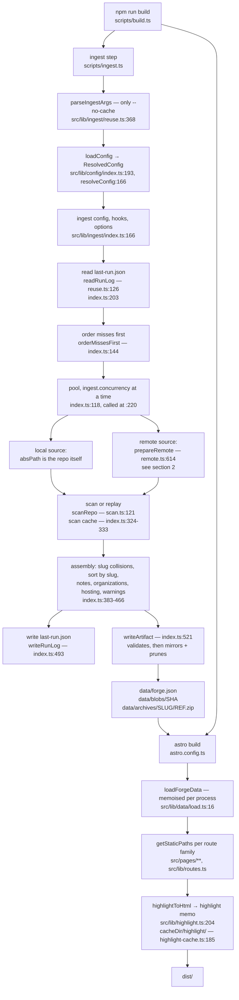

# Build steps

What `npm run build` actually does, in order, with the file and line to read for each step.

```
npm run build  =  tsx scripts/build.ts
                  ├ tsx scripts/ingest.ts   git + forge APIs → data/forge.json
                  └ astro build             data/forge.json → dist/
```

`scripts/build.ts` exists so the two halves can be steered separately — a chained npm script
gives every `--` argument to the last command in the chain, so there was no way to say "skip
the ingest". It routes arguments three ways: `--no-ingest` it keeps, ingest flags
(`--no-cache`, `--backfill-metadata`) go to `scripts/ingest.ts`, and everything else is passed
through to `astro build` untouched. `--no-ingest` refuses to run when no artifact exists,
because `loadForgeData` answers a missing artifact with an EMPTY one — the build would
otherwise succeed and replace a good `dist/` with a site containing no repos.

Two processes, one artifact between them. Ingest talks to git and to forge APIs and writes
`data/forge.json` plus its byte stores; `astro build` never touches git or the network — it
reads that artifact and nothing else. The boundary is deliberate and it is the reason the
site is reproducible: the same repositories at the same commits produce a byte-identical
artifact, and the same artifact produces the same pages.

`npm run dev` is downstream of all of this: it serves `dist/` from the last build and renders
nothing (`scripts/dev.ts`). See [quick-start](../user/quick-start.md#4-run-it).

---

## 1. The whole pipeline



Reading the diagram top to bottom:

- **Flags.** `--no-cache` is the only one ingest takes; anything else is an error
  (`parseIngestArgs`, `src/lib/ingest/reuse.ts:368`).
- **Config.** `resolveConfig` (`src/lib/config/index.ts:166`) turns `frznforge.config.ts` into
  absolute paths — `outDir`, `cacheDir`, and one `absPath` per source: the directory for a
  local repo, the mirror path inside `cacheDir` for a remote one (`cachePathFor`,
  `src/lib/config/index.ts:133`). Everything downstream sees one shape.
- **Repos run concurrently**, `ingest.concurrency` at a time (default 4,
  `src/lib/config/schema.ts:398`). Processing order never reaches the artifact: assembly sorts
  by slug (`src/lib/ingest/index.ts:410`) and the run log is keyed by path.
- **The artifact is written last and validated first.** `writeArtifact`
  (`src/lib/ingest/index.ts:521`) parses `ForgeData` before writing a byte, then makes
  `blobs/` and `archives/` mirror their maps exactly — new files written, stale ones deleted.
- **`astro build` reads the artifact once.** `loadForgeData` memoises it for the process
  lifetime (`src/lib/data/load.ts:16-28`), which is why an Astro dev server serves a stale
  artifact until restarted, and why `npm run dev` is `astro preview` instead.

Exit codes: ingest exits 0 with warnings — an empty repo, an unreachable forge, a missing path
are all warnings (`scripts/ingest.ts:73-86`). It exits 1 only for a bad config, an unwritable
`outDir`, a missing `git`, or `ingest.failOnDegraded` (section 4).

---

## 2. One remote source, end to end

This is the path 0.3.0 reworked. Every decision below is "can we avoid touching the network,
provably, without changing a single artifact byte?" — so the ordering is cheapest-first, and
each skip has to be safe rather than merely fast.

One ordering detail worth stating up front, because it is the opposite of what most people
guess: **provider metadata is fetched before the mirror is updated.** The API answer supplies
the clone URL, so it has to come first; when the API fails, the mirror is still refreshed from
a URL derived from the config (`deriveWebUrl`, `src/lib/ingest/remote.ts:399`). The comment at
`src/lib/ingest/remote.ts:606-613` is the authority on this.

```mermaid
sequenceDiagram
  autonumber
  participant I as ingest pool worker<br/>index.ts:220
  participant RL as last-run.json<br/>reuse.ts:117
  participant P as prepareRemote<br/>remote.ts:614
  participant PC as REPO-DIGEST.meta.json<br/>remote.ts:575
  participant API as JsonClient + OriginBackoff<br/>http.ts:84 / backoff.ts:63
  participant M as ensureMirrorLocked<br/>remote.ts:296
  participant SC as scan/DIGEST.json<br/>reuse.ts:248
  participant S as scanRepo<br/>scan.ts:121

  Note over I: misses-first ordering ran BEFORE the pool<br/>index.ts:144 — stats each source's<br/>.meta.json; sources with none go first

  I->>RL: entry for this source's absPath<br/>read once at index.ts:203
  RL-->>I: fetchedAt, fresh, gitOk, metaOk, heads

  Note over I: freshness window (minutes, on)<br/>withinFreshWindow — reuse.ts:187<br/>index.ts:279
  Note over I: cooldown (hours, opt-in, stricter:<br/>needs gitOk AND metaOk)<br/>withinCooldown — reuse.ts:211<br/>index.ts:281
  I->>P: prepareRemote(skipFetch, noCacheReads,<br/>skipUnchanged, knownHeads)<br/>index.ts:292

  P->>PC: readProviderCache — remote.ts:580
  PC-->>P: meta + releases, or null

  alt skipFetch and cache and mirror both present
    Note over P: no network at all — action 'reused',<br/>fetchStatus null; the caller keeps the<br/>previous run-log stamp<br/>remote.ts:640-664
    P-->>I: scanSource from cache
  else a real fetch
    P->>API: fetchMeta, then fetchReleases in provider mode<br/>remote.ts:684, :691
    Note over API: per-ORIGIN gate, shared process-wide:<br/>beforeRequest — backoff.ts:97 (http.ts:177)<br/>noteRateLimit — backoff.ts:128 (http.ts:182)<br/>short waits are slept; a long Retry-After<br/>blocks the origin so every other repo on<br/>that host fails fast into its cache
    API-->>P: metadata / releases, or ImporterError
    Note over P: failures → remote-* warning + cached half<br/>remote.ts:490-505, :711-721
    P->>PC: writeProviderCache when either half was fresh<br/>remote.ts:724
    P->>M: ensureMirror(cloneUrl, token, skipUnchanged, knownHeads)<br/>remote.ts:734
    opt skipUnchanged and knownHeads non-empty
      M->>M: git ls-remote --heads --tags<br/>remote.ts:332
      Note over M: every ref equal to knownHeads →<br/>action 'current', no fetch<br/>remote.ts:334-336
    end
    alt mirror exists
      M->>M: git remote update --prune → 'fetched'<br/>remote.ts:339
    else no mirror yet
      M->>M: git clone --mirror → 'cloned'<br/>remote.ts:359
    end
    Note over M: any failure returns, never throws:<br/>'cached' with the old mirror, or 'missing'
    P-->>I: scanSource, action, warnings,<br/>fetchStatus {git, meta} — remote.ts:773-782
  end

  I->>I: readRefHeads on the mirror → next run's baseline<br/>reuse.ts:142, index.ts:312

  I->>SC: scanInputDigest over refs, HEAD, scanSource, opts<br/>reuse.ts:257, index.ts:324
  alt digest matches the recorded entry
    SC-->>I: rehydrateScan — blobs and archives read back<br/>from outDir, archives hash-checked<br/>reuse.ts:332, index.ts:328
  else miss, or anything missing
    I->>S: scanRepo — the real scan
    S-->>I: repo, blobs, archives
    I->>SC: writeScanCache — index.ts:333
  end

  Note over I: assembly: remote warnings stamped with the slug,<br/>slug-collision rename, sort by slug<br/>index.ts:378-410
```

### The four skips, and why each is safe

| Skip | Config | Where | Why it cannot change the artifact |
|---|---|---|---|
| Misses first | always on | `index.ts:144` | Reorders *processing* only. A source with no `.meta.json` is new or previously failed, so it gets the network budget first. Output is slug-sorted; the run log is keyed by path. |
| Freshness window | `ingest.reuse.maxAgeMinutes`, default 2 (`config/schema.ts:468`) | `reuse.ts:187`, `index.ts:279` | Requires the previous run to have been *fully fresh*. Cache + mirror are then exactly what a fetch would have returned, so the fast path emits no warning either (`remote.ts:640`). A degraded run is never window-skipped, so a rate limit heals itself. |
| Cooldown | `ingest.reuse.cooldownSeconds`, default `null` (`config/schema.ts:489`) | `reuse.ts:211`, `index.ts:281` | Same mechanism, longer horizon, and deliberately stricter: it demands `gitOk && metaOk`, so a repo whose metadata was rate-limited is never held back for hours. |
| Same-commit probe | `ingest.reuse.skipUnchanged`, default `false` (`config/schema.ts:480`) | `remote.ts:331-338` | One `ls-remote` against the remote's ref advertisement versus the mirror's refs at the end of the last run. Mirrors fetch per *repository*, so the only honest granularity is "every ref matches" — then `remote update` provably has nothing to do. Any difference, or any failure of the probe, falls through to a normal update. |

Both time-based skips share one flag into `prepareRemote` (`skipFetch`) and differ only in
what gets reported: the cooldown sets `RemoteStatus.cooldown`, which is why the ingest console
prints `⚠️ <slug>: this repo is on cooldown` rather than the ordinary `⇄` line
(`scripts/ingest.ts:47-52`). Both apply only under `ingest.fetch: 'auto'` — `'always'` is an
explicit ask to fetch and `'never'` must keep emitting its stale-cache warnings.

### Where each cache lives

| Cache | Path | Written by | Read by | Keyed on |
|---|---|---|---|---|
| Run log | `<cacheDir>/last-run.json` | `writeRunLog`, `reuse.ts:133` (called `index.ts:493`) | `readRunLog`, `reuse.ts:126` (called `index.ts:203`) | whole file: `configHashFor(config)`; entries: the source's `absPath` |
| Provider answers | `<cacheDir>/…/<repo>-<digest>.meta.json` | `writeProviderCache`, `remote.ts:597` | `readProviderCache`, `remote.ts:580` | the mirror path (`providerCachePathFor`, `remote.ts:575`) |
| Mirror | `<cacheDir>/…/<repo>-<digest>.git` | `git clone --mirror` / `git remote update` | `scanRepo` | `cachePathFor`, `config/index.ts:133` |
| Scan result | `<cacheDir>/scan/<digest>.json` | `writeScanCache`, `reuse.ts:307` | `readScanCache` + `rehydrateScan`, `reuse.ts:283`/`332` | `scanInputDigest`: refs + HEAD + `ScanSource` (provider metadata and releases included) + `ScanOptions`, `reuse.ts:257` |
| Highlight memo | `<cacheDir>/highlight/<key>.gz` | `memoizeHighlight`, `highlight-cache.ts:185` | same | Shiki fingerprint + effective language + line-id prefix + source, `highlight-cache.ts:221` |

**The highlight memo is not part of ingest.** It is read and written during `astro build`,
inside `highlightToHtml` (`src/lib/highlight.ts:204`), once per distinct highlighted file
rather than once per page. It shares `ingest.cacheDir` and the `ingest.reuse.enabled` switch
(`highlight-cache.ts:72`) but nothing else: `npm run ingest -- --no-cache` does not touch it,
and `FRZNFORGE_NO_HL_CACHE=1` is its own bypass. It is also the only one of these that is
never pruned — see [performance.md](./performance.md#measured-the-highlight-memo-020).

Two invariants hold across all of them: a replay must be indistinguishable from the real work
(the scan cache re-reads blob bytes from `outDir` and hash-checks archives, `reuse.ts:332-357`,
so `writeArtifact`'s prune never deletes a cached repo's files), and nothing clock-derived may
reach `forge.json` — timestamps live only in `last-run.json`, and clocks are injected
(`PrepareRemoteDeps.now`, `remote.ts:433`).

---

## 3. From artifact to `dist/`

`astro build` is an ordinary Astro static build. The only bridge from the project config is
`site.base` → Astro's `base` (`astro.config.ts:10-20`), and `build.concurrency: 2` (measured;
see [performance.md](./performance.md#measured-astro-render-concurrency-020-adopted-at-2)).

Every route family gets its paths from the artifact through `loadForgeData`
(`src/lib/data/load.ts:16`) and the helpers in `src/lib/routes.ts`; file contents come from the
content-addressed blob store (`readBlobBuffer`, `src/lib/data/load.ts:36`). Page counts are
arithmetic on the artifact — the formula, the measured numbers and the knobs that move them
are in [performance.md](./performance.md#where-the-pages-come-from).

---

## 4. Where success and failure are recorded

**Console, during the run.** `scripts/ingest.ts` prints `▸ <slug>` per repo, `⇄ <slug>
(<provider>: <action>)` per remote (or the cooldown line), `✓` with the per-repo counts, then
every warning as `⚠ [code] repo: message`, then a one-line summary. A run that served anything
from cache or skipped a repo also prints the `! remote sources:` line (`scripts/ingest.ts:78-86`)
so a stale build is never silent.

**`<cacheDir>/last-run.json`** — run log v2 (`RunLogEntry`, `src/lib/ingest/reuse.ts:83-107`),
one entry per remote source, written at `index.ts:471-493`:

| Field | Meaning |
|---|---|
| `fetchedAt` | when the last real fetch **attempt** happened. A window-skipped source keeps its previous stamp, so the window cannot extend itself (`index.ts:474-478`). |
| `fresh` | that attempt was fully clean: not skipped, no degraded `remote-*` warning. This is what the freshness window reads. |
| `gitOk` | git actually reached the remote: action was `fetched`, `cloned`, or `current` (`remote.ts:778`). |
| `metaOk` | every provider call this run wanted succeeded — a releases failure that fell back to cache still counts as a failed metadata fetch (`remote.ts:781`). |
| `heads` | the mirror's `refs/heads/*` and `refs/tags/*` → object id after this run (`readRefHeads`, `reuse.ts:142`). This is the baseline the next run's `ls-remote` probe compares against; when it could not be read the previous baseline is kept rather than erased (`index.ts:490`), because a forgotten baseline costs one extra fetch while a wrong one would skip a fetch that was needed. |

`gitOk`/`metaOk` are reported by `prepareRemote`, not inferred from warning codes, because
`remote-cache-stale` is raised both for a mirror that could not be refreshed and for provider
metadata served from cache — the code alone cannot tell the halves apart.

A run log whose `configHash` does not match the current config is ignored wholesale
(`index.ts:204`), as is one written by an older version (`readRunLog`, `reuse.ts:126-131`).

**Warnings in the artifact.** The four remote codes (`src/lib/data/schema.ts:374-380`):

| Code | Raised when |
|---|---|
| `remote-fetch-failed` | the API call failed for any reason that is not the two below, the mirror errored, a releases listing was truncated, or provider metadata failed schema validation (`remote.ts:504`, `:550`, `:697`, `:745`) |
| `remote-auth-missing` | an auth or not-found failure **with no token in the environment** — the message names the variables it looked in (`remote.ts:500-502`) |
| `remote-rate-limited` | the provider said so, including the fast-fail from a hard-blocked origin (`remote.ts:499`, `backoff.ts:101`) |
| `remote-cache-stale` | published from cache rather than a fresh answer: `ingest.fetch: 'never'`, a cached metadata/releases fallback, or a mirror that could not be refreshed (`remote.ts:676`, `:720`, `:748`) |

Those four are exactly `DEGRADED_WARNING_CODES` (`src/lib/ingest/index.ts:68`). They set
`fresh: false` in the run log, so a degraded source is always retried next run, and they are
what `degradedRepos` (`index.ts:76`) reports.

**`ingest.failOnDegraded`** (default `false`, `src/lib/config/schema.ts:442`). Opt-in, for CI
that would rather fail than publish stale metadata after a rate limit. It only decides the exit
code: the artifact is already written and the warnings already printed by the time it is
consulted (`scripts/ingest.ts:88-99`).

**`--no-cache`** (`scripts/ingest.ts:24-28`, threaded as `IngestOptions.noCache`,
`index.ts:106-114`) bypasses **reads** only:

- the provider `.meta.json` is not read — but it is still *written*, and the on-disk copy is
  preserved half-by-half so a partial refresh cannot destroy what offline builds depend on
  (`remote.ts:632-636`, `:724-728`);
- the freshness window and the cooldown are off (`reuseReads`, `index.ts:197`), and so is the
  same-commit probe (`index.ts:297-298`);
- the scan cache is not replayed (`index.ts:326`), though a fresh scan is still recorded;
- `ingest.fetch` is forced to `'always'` for the run, **without** entering the hashed config
  (`index.ts:205-207`) — so the run log this run writes is still readable by the next ordinary
  run, which is what makes "`--no-cache` still records its fresh results" true rather than a
  dead letter;
- the highlight memo is unaffected: it belongs to `astro build`, and its bypass is
  `FRZNFORGE_NO_HL_CACHE=1`.

---

## See also

- [performance.md](./performance.md) — what each step costs, measured, and the knobs.
- [data-model.md](./data-model.md) — the `forge.json` contract itself.
- [configuration.md](../user/configuration.md) — every key named above.
