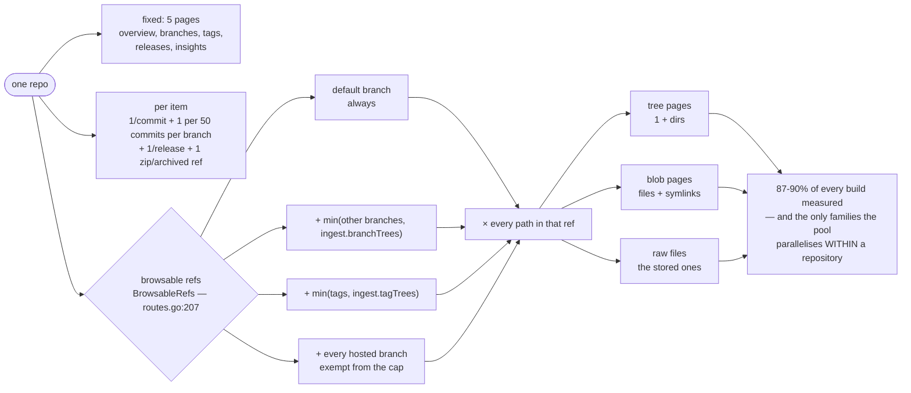

# Build performance

frznforge emits a fully static site, so "how long does it take" is really "how many pages are
there", and the page count is arithmetic on the artifact. This document gives you that
arithmetic, the numbers measured on real corpora, the knobs that move them, and the things we
deliberately did not build.

0.4.0 replaced the Astro/TypeScript build with a Go binary, so most of the tables below have a
before column and an after column. The before numbers are kept rather than deleted: a rewrite
with no "before" can only be argued about, and several of the *rejections* recorded here were
argued on reasoning that survives the engine swap entirely.

This document is about *cost*. For what the pipeline actually does — the order of the steps,
where each cache is read and written, and what a run records about itself — see
[build-steps.md](./build-steps.md).

## Where the pages come from

Almost every page belongs to one of three families, and one of them is multiplied.



The shape is why the levers that matter are ref-count levers (`branchTrees`, `tagTrees`) rather
than anything about pages, and why the worker pool bothers to descend below the repository level
at all.

**Per repo, once:** the overview, `/branches/`, `/tags/`, `/releases/`, and (schema v5)
`/insights/` when `routes.HasInsights(repo)` (`internal/routes/routes.go:260`).

**Per repo, per item:** one page per commit in `repo.commits` (plus, schema v6, one per
display-support commit in `repo.extraCommits` — nonzero only when the history-narrowing knobs are
set or a tag points outside branch history), one paginated commit-list page per 50 commits *per
branch* (`routes.CommitsPerPage`, `internal/routes/routes.go:26`), one page per release, one zip
per archived ref.

**Per repo, per browsable ref × per path** — this is the multiplier:

```
tree pages = Σ over browsable refs ( 1 + directories in that ref )
blob pages = Σ over browsable refs ( files + symlinks in that ref )
raw files  = Σ over browsable refs ( files whose FileInfo.stored is true )
```

A **browsable ref** is a ref that has a tree in the artifact
(`routes.BrowsableRefs`, `internal/routes/routes.go:207`):

```
browsable refs = 1 (the default branch)
               + min(other branches, ingest.branchTrees)     # 'all' ⇒ no limit
               + min(tags,           ingest.tagTrees)        # minus name collisions
               + any hosted branch, which is exempt from the branch cap
```

So the whole repo comes out as:

```
pages(repo) = 5                                   # overview + branches + tags + releases + insights
            + refs × (1 + dirs + files + symlinks + stored files)
            + Σ over branches ⌈commits(branch) / 50⌉
            + |repo.commits| + |repo.extraCommits|
            + distinct release tags
            + archives
```

Worked example — `sdu` from the benchmark below: 2 branches, 2 tags, `tagTrees: 3` ⇒ **4
browsable refs**, each with ~21 tree entries (4 dirs, 17 blobs, 17 of them stored).

```
5 + (18 tree + 68 blob + 68 raw) + 2 commit-list pages + 49 commits + 2 releases + 3 zips = 215
```

`Router.RepoRoutes` (`internal/routes/routes.go:504`) is the code that decides this, and
`Router.AllRoutes` (`:581`) is the whole list — the same function the sync tests read, which is
why "the artifact has a page for everything" is checkable without running a build.

Two footnotes that matter when you compare numbers:

- **Routes are not all `.html`.** `raw/*` routes write the file's bytes and archives write
  `.zip`s — two different route→file rules, documented in
  [build-steps.md § Routes to files](./build-steps.md#routes-to-files-two-rules-not-one). In the
  four-repo benchmark below, 21,869 routes produced 13,164 HTML pages and 8,715 other files. When
  someone says "16k pages", check which they mean.
- **The multiplier is the whole story.** Tree + blob + raw are 87–90% of every build we have
  measured, which is why they are the families the worker pool parallelises *within* a repository
  and not only across repositories.

## The 0.3.0 baseline — 0.4.0's reference point

Taken on the released 0.3.0 pipeline immediately before the rewrite began, and recorded first on
purpose.

**Machine** (every number in this document unless a section says otherwise). Windows 11 Pro
26200, AMD Ryzen 9 7945HX (16 cores / 32 threads), 61.7 GB RAM, Node v24.6.0, git 2.50.1, Astro
7.2.9, Go 1.24.5. Measured **2026-09-06**, schema v8.

### Corpus 1 — this repository's own site, as it stood at the baseline

One repo, 5 notes, 1 organization; 2 browsable refs at 290 tree entries each — **1,077 routes**,
of which 1,018 (94.5%) are the tree + blob + raw multiplier.

| step | command | time |
|---|---|---:|
| ingest, warm | `npm run ingest` | 1.077 s |
| ingest, cold | `npm run ingest -- --no-cache` | 3.050 s |
| render, cold | `FRZNFORGE_NO_HL_CACHE=1 npm run build -- --no-ingest` | 18.747 s |
| render, warm | `npm run build -- --no-ingest` | 6.565 s |
| **build, warm** | `npm run build` | **7.214 s** |

Output: 1,187 files, 633 HTML pages, 65.6 MB.

The highlight memo was worth 12.2 s of that 18.7 s render — **65%**. That number is the bar
Phase 5 held chroma to before deciding whether to port the cache at all; see
[the verdict](#measured-then-deleted-the-highlight-memo).

### Where the JavaScript went

`dist/_astro/` was **102 files, 3,495,584 bytes**, of which everything frznforge wrote was
**79,924 bytes — 2.3%** (`Base.css` 59,682, `RepoListing.js` 10,681, `CommandPalette.js` 6,003,
the mermaid island 3,196, `base.js` 362). The other **3.42 MB was mermaid and its dependency
tree** across ~97 Vite chunks — cytoscape 435 KB, katex 259 KB, then a chunk per diagram type.

Two consequences the rewrite acted on:

- **Dropping Svelte is not what shrinks that directory.** The two islands plus the shell script
  were 17 KB of 3.5 MB. The framework runtime is real and it went, but the headline number was
  mermaid.
- **Mermaid was the one dependency that genuinely needed a bundler**, and the plan forbade one.
  It became a vendored, pre-built ESM asset in `web/vendor/`, copied verbatim like every other
  file under the no-build rule.

After both: `dist/_astro/` went to **2 files / 64,281 bytes** — stylesheets only, zero JavaScript
— and `dist/` fell from 65.6 MB to 62.0 MB across the same 633 pages.

### Corpus 2 — the four-repo remote corpus

Not re-measured for the baseline: it needs the network and ~5 minutes, and nothing about it had
changed. At the default caps: **21,869 routes / 13,164 HTML pages / 204.2 s render / 7.1 s warm
ingest / 854.2 MB** — see [Measured: `ingest.branchTrees`](#measured-ingestbranchtrees-before-and-after).
It is the corpus where fetch time and render time are the same order of magnitude, which is why
the plan pointed the streaming-pipeline question at it.

## Measured: the Go renderer (0.4.0)

Same artifact, same machine, same day as the baseline. One repository, 1,205 emitted files, of
which 1,022 are the tree/blob/raw multiplier.

| build | time |
|---|---:|
| `astro build`, this artifact | 8.74 s |
| 0.3.0 render, cold (no highlight memo) | 18.75 s |
| 0.3.0 render, warm (memo hit) | 6.57 s |
| **`frznforge build --no-ingest --serial`** | **3.66 s** |
| **`frznforge build --no-ingest`** (default workers) | **1.84 s** |

The Go build with **no cache of any kind** is 3.6× faster than the TypeScript build *with* its
highlight memo, and 10× faster than the same build cold.

### Where the parallelism actually is

Per-**repo** parallelism is the obvious design and it is not enough. It is bounded by the
repository count, and the count is frequently one — this project's own site was a single
repository whose tree/blob/raw pages are 85% of its output. Measured at one repo, per-repo
parallelism did nothing at all: 3.74 s at one worker, 3.92 s at thirty-two, the difference being
pool overhead.

The pool is therefore used at both levels — repositories concurrently, and the tree/blob/raw
families concurrently *within* a repository — under one shared semaphore, so the two levels cannot
multiply into N² goroutines (`internal/build/parallel.go:31-45`). Scaling on the single-repo site:

| workers | 1 | 2 | 4 | 8 | 32 |
|---|---:|---:|---:|---:|---:|
| time | 3.66 s | 2.78 s | 2.33 s | 1.87 s | 1.84 s |

It flattens after 8, which is what a workload that is part CPU and part file-write should do. The
default is `GOMAXPROCS-1` (`internal/build/parallel.go:278`), which lands on the flat part of that
curve on any machine worth parallelising on.

### Corpus 3 — 73 repositories, parallel against serial

The single-repo site proves the *within-repo* half. The developer's own 73-repository corpus is
where both levels are exercised at once, and it is the corpus that found the deadlock the pool
was rewritten to prevent.

| build | files | time |
|---|---:|---:|
| `frznforge build --no-ingest --serial` | 47,158 | **119 s** |
| `frznforge build --no-ingest` (default workers) | 47,158 | **61 s** |

**Byte-identical**, which is the acceptance bar rather than a bonus. Concurrency is the classic
way to lose determinism, so serial and parallel output must match exactly or the speed is worth
nothing. `TestSerialAndParallelAgree` (`internal/build/parallel_test.go:22`) holds it, under
`-race`.

Just under 2× on 32 threads is the honest shape of this workload rather than a disappointment.
The build is part CPU (markdown, highlighting, template execution) and part synchronous file
write, and the per-lexer lock below serialises tokenising *within* a language — so a corpus
concentrated in one or two languages gets less than its core count suggests.

### The bug parallelism found

Building with pages in parallel produced spurious chroma **Error** tokens — single characters
wrapped in an error span, at random positions, inside long lines of large files. A page that
still renders, with one letter quietly turned red.

chroma's registry hands every caller the same lexer value. The corruption reproduced only under
the race detector's scheduling, never in isolation, and the detector itself reported no race —
which is the worst combination to leave in place. Tokenising is now serialised per lexer *name*
(`internal/highlight/highlight.go:260-289`), so different languages still run concurrently, and
the lock covers draining the iterator as well as creating it because chroma's iterators are lazy:
the work happens in `Tokens()`, not in `Tokenise()`.

It costs about 0.7 s of the 1.8 s on the single-repo corpus, because a repository's files cluster
into a few languages and therefore a few locks. Before the fix, serial and 32-worker builds
differed in 15–21 files per run, a different set each time.

## Measured, then deleted: the highlight memo

*This is the 0.4.0 verdict on the cache 0.2.0 built. The measurement that motivated the cache is
kept below it, because it is why the cache existed and why deleting it needed numbers rather than
a preference.*

**0.4.0 ships no highlight memo at all** (`internal/highlight/highlight.go:15-18`).

The plan reserved judgement on porting `src/lib/highlight-cache.ts` until there were numbers: the
memo existed because Shiki was 84% of the render, and the question was whether chroma left
anything for it to save. It does not. A completely cold Go render is **1.84 s** — well inside the
**6.57 s** the TypeScript build achieved *warm*. Porting a cross-run, content-addressed,
fingerprint-invalidated cache to save a fraction of two seconds would be buying complexity with
the one currency the rewrite was trying to spend less of.

The cache also had an ongoing cost the timings do not show: it was documented as growing without
bound, because tracking liveness across runs is exactly the invalidation problem it was designed
to avoid. Deleting it removes that too.

*Migration:* `<cacheDir>/highlight/` is now dead. Nothing writes it, nothing reads it, deleting it
is safe — it always was, and that was the intended way to reclaim it.

### Why the memo existed (0.2.0)

The 0.2.0 plan asked for the *rebuild* to get faster, and after `ingest.reuse` the remaining cost
was all rendering. Instrumenting `highlightToHtml` on the self-build answered it in one line:

```
[hl] calls=429 ms=21404 bytes=3728368
```

**21.4 s of a 25.5 s static-route phase — 84% of the render — was Shiki**, tokenizing 3.7 MB of
source. Everything else (611 pages of layout, markdown, listings, the search index, the Vite
bundles) shared the other 16%. Memoizing a pure function cut a no-change rebuild by 66%
(23.1 s → 7.9 s) for a 2.5 MB cache of 321 gzipped entries.

Two findings from that work outlived the cache and are worth keeping:

- **Key on the *effective* language, not the requested one.** A grammar load can fail for reasons
  unrelated to the grammar existing, and the render then falls back to plain text. Had the key
  still said `typescript`, that unhighlighted output would have been stored under the TypeScript
  key and served forever. The Go highlighter has the same shape of hazard and answers it the same
  way: a lexer that cannot be resolved, or that fails to tokenise, degrades to plain lines
  (`internal/highlight/highlight.go:291-296`) rather than to a missing page.
- **The language map has to be checked in both directions.** Shiki's table covered 51 of the 85
  names ingest can emit and spelled one of them `'Ini'` where ingest emits `'INI'`, so `.cfg` and
  `.conf` files rendered uncoloured and nobody noticed. `LanguageToChroma`
  (`internal/highlight/highlight.go:46`) keys every name ingest can produce, and a missing key is
  a test failure (`TestLanguageMapCoversIngest`) rather than an uncoloured file.

### Why the memo was not skip-unchanged-pages

Worth being precise about, because the objection to *that* idea is a correctness objection and it
still stands under the Go renderer — see
[Measured, then rejected again](#measured-then-rejected-again-skip-unchanged-pages).

Skip-unchanged-pages proposes *not rendering a page* and copying last build's output forward.
That requires a dependency graph from artifact fields to output pages, and a miss anywhere in it
ships a stale page in a build that reports success.

The memo memoized *one deterministic function call inside a render*. Every page was still
rendered in full, from the artifact, on every build. That property was tested rather than
asserted, and verified end to end by building the site twice — once with the memo, once with it
disabled — and hashing all 1,153 output files: **not one of the 423 pages carrying highlighted
markup differed**. Eleven files did differ, every one of them a page showing relative dates, and a
control run with the memo disabled on *both* sides produced the same drift — which is what
identified it as the clock rather than the cache.

## Measured: `ingest.branchTrees`, before and after

The problem the cap fixes: tree/blob/raw pages are generated per browsable ref, and nothing
bounded how many branches were browsable. Four real public repos with 27 + 22 + 8 + 2 branches
made every one of them browsable.

*Measured on the Astro renderer (2026-08-24, schema v5, Astro 7.2.4). The **page counts** are a
property of the artifact and are unchanged by 0.4.0 — `BrowsableRefs` applies the same cap. The
**times** are Astro's and are superseded by the Go figures above; they are kept because the
before/after ratio is what the section is about.*

**Corpus.** Four public repos — GitHub `Descent098/sdu`, GitLab `gitlab-org/release-cli`, Gitea
`gitea/tea`, Codeberg `dnkl/fuzzel` — with `maxCommits: 200`, `tagTrees: 3` and a warm mirror
cache. Both runs used the identical working tree; only `ingest.branchTrees` changed.

| | `branchTrees: 'all'` | `branchTrees: 10` (default) | change |
|---|---:|---:|---:|
| browsable refs | 70 | 43 | −39% |
| routes | 27,813 | 21,869 | −21% |
| HTML pages | 16,388 | 13,164 | −20% |
| render (Astro) | 301.2 s (5m01) | 204.2 s (3m24) | **−32%** |
| ingest (warm cache) | 9.1 s | 7.1 s | −22% |
| `dist/` on disk | 1,245.5 MB | 854.2 MB | −31% |
| files in `dist/` | 27,823 | 21,879 | −21% |

Per repo:

| repo | branches | refs (all → 10) | pages (all → 10) | change |
|---|---:|---:|---:|---:|
| `fuzzel` | 27 | 30 → 14 | 6,928 → 4,687 | −32% |
| `release-cli` | 22 | 25 → 14 | 6,891 → 3,188 | −54% |
| `tea` | 8 | 11 → 11 | 13,759 → 13,759 | **0%** |
| `sdu` | 2 | 4 → 4 | 215 → 215 | 0% |

### Read this honestly

The cap does what it claims — a third off the build, a third off the output — but it only helps
repos that have more than ten branches. `tea` has eight, so the default never touches it, and
`tea` alone is **63% of the capped build** (13,759 of 21,869 routes). Its cost is not branch
count: it is 647 tree entries per ref (a Go repo that vendors its dependencies) times 11 refs,
three of which are tags.

Two consequences:

- For a vendored monorepo, `ingest.tagTrees` and a *low* `branchTrees` are the levers, not the
  default. `tea`'s eleven refs are wildly uneven: its default branch costs 704 pages, but its
  `release/v0.7` branch costs 3,812 and `release/v0.4` 2,185 — old branches that vendored more
  than the current one does. At `branchTrees: 0, tagTrees: 0` the repo would be **~1,240 pages
  instead of 13,759**, an order of magnitude, from one line of config.
- The default of 10 is a safety rail against pathological branch counts, not a tuning knob.
  Anyone with a big repo still has to think about it. That is why the cap warns
  (`branch-trees-capped`) instead of silently trimming.

## Measured: cross-run ingest reuse (`ingest.reuse`, 0.2.0 — ported unchanged)

The 0.2.0 plan asked why "the rebuild time with a constructed cache is as slow as a build without
one". The honest answer was that until 0.2.0 the caches saved **network only**: the mirror saved
the clone, `.meta.json` saved the API calls, and every run still re-ran the full scan —
`for-each-ref`, the whole `git log`, `ls-tree` per browsable ref, `cat-file --batch` of every
stored blob, `git archive` per treed ref, the insights checkpoints. `ingest.reuse` (on by default)
closes that: a repo whose refs, HEAD, metadata inputs and scan options are unchanged replays its
recorded scan from `<cacheDir>/scan/<digest>.json`, and a remote source fetched fully-fresh within
the last `maxAgeMinutes` (default 2) is not re-fetched at all.

Reuse never changes artifact bytes — a hit replays exactly what the fresh scan produced, or
quietly falls back to a real scan. 0.3.0 added two more skips ahead of it (an opt-in cooldown and
an opt-in same-commit `ls-remote` probe) plus misses-first ordering;
[build-steps.md § The four skips](./build-steps.md#the-four-skips-and-why-each-is-safe) walks each
one and the argument for why it cannot change a byte. All four ported to Go with their arguments
intact.

Measured on this repository's own site (1 repo, 18 commits, 219 files, 5 notes, 2026-08-28,
warm mirror):

| run | ingest |
|---|---|
| cold scan cache (first run) | ≈ 2.0 s |
| warm (nothing changed) | ≈ 0.22–0.24 s |

−89% on the no-change re-ingest. Keep the proportions in mind: on the four-repo remote corpus,
warm-cache ingest was 7.1 s against a 204 s render — ingest reuse makes the small half smaller.
The large half was a page-count problem, and 0.4.0 attacked it with cores rather than with a
cache. `frznforge ingest --no-cache` bypasses every ingest-side cache for one run;
`internal/ingest/reuse_test.go` is the correctness half (byte-identity, tamper-proof
hit/invalidation cases, the degraded-repo retry rule, prune safety).

## History: Astro render concurrency (0.2.0, adopted at 2)

*Moot since 0.4.0 — Astro is gone, and `build.concurrency` with it. Kept because the shape of the
measurement is the reason the Go pool looks the way it does.*

Astro exposed one knob: how many pages render at once inside its single process. Measured on the
self-build (schema v6 artifact, ~600 pages, two runs per value, 2026-08-28):

| `build.concurrency` | runs | median |
|---|---|---|
| 1 (Astro's default) | 19.2 s, 19.6 s | ≈19.4 s |
| **2 (adopted)** | 18.2 s, 17.6 s | ≈17.9 s |
| 4 | 21.8 s, 19.0 s | ≈20.4 s |

2 was a small (~8%) but consistent win and 4 was measurably worse — because the pages' blob reads
were synchronous, so there was little I/O for concurrent renders to overlap and the render was
CPU-bound.

**What carried over.** The diagnosis was right and the ceiling was Astro's: one process, one
granularity, and no per-repo build unit to parallelise. Go's pool answers the same CPU-bound
workload with real parallelism at two granularities and lands at ~8 workers instead of 2 — a
2× improvement instead of an 8% one, on the same machine and the same artifact.

## Measured, then rejected again: skip-unchanged-pages

*Rejected in 0.2.0, re-tested in 0.3.0, and the reasoning survives the engine swap in full — with
one number in it now much smaller.*

The wish was "if the most recent commit hash matches the one on the page, skip rebuilding it in
`dist`". It was re-tested against a concrete case: backfilling metadata for 13 repos of 73 looks
like it should only need those repos' overview pages re-rendered. It does not. A repo's
description and license badge are drawn on **every** page of that repo (thousands of blob and tree
pages), and its description and tags also feed the listing, the profile, the org pages and
`search-index.json`. The set of pages a metadata change can touch is therefore most of the site.

What a route → input-hash manifest would still have to model before a single page could be
skipped safely: `search-index.json` (any repo/note/org change), every listing page and the sidebar
counts (any repo added/removed/renamed), the footer warning count on every page (any warning
anywhere), the profile's contribution graph / activity feed / KPIs (any commit anywhere), org
overview aggregates (any member change), and — under Astro — `_astro/*` hashed asset names, since
any CSS/JS change relinked every page. A miss in any of these is a silently wrong page in a build
that reports success.

**0.4.0 makes the answer easier, not harder.** Two of the arguments moved:

- The hashed-asset term is gone. Assets are copied verbatim with no content hash
  (`internal/build/build.go:448`), so a CSS edit no longer relinks anything.
- The cost side collapsed. In 0.3.0 the measured price of just re-rendering everything was
  **2 minutes** for 27,060 pages with the highlight memo warm. On the Go renderer the 73-repo
  corpus is **61 s for 47,158 files, cold, with no cache of any kind**. Owner decision, 2026-09-03:
  leave it. Nothing since has made a copy-forward manifest that can be silently wrong look like a
  better trade.

## Measured, then rejected: sqlite for blobs + cache (0.2.0)

The 0.2.0 wish list asked whether storing blobs and cache data in sqlite "can help make things
faster instead of storing it all as files". Measured, that cost is a rounding error. On the
self-build artifact (295 blobs, 2.8 MB), timed through the two functions a backend swap would
replace:

| operation | measured |
|---|---|
| read every blob in the store | 45 ms |
| write the artifact, cold (every byte written) | 188 ms |
| write the artifact, warm (stat-and-skip pass) | 25 ms |

Against a ≈2.3 s cold ingest and — now — a 1.84 s render, a storage backend that cost literally
zero would win a few hundred milliseconds. On the four-repo remote corpus, warm-cache ingest
(7.1 s) is dominated by git subprocess work, not blob I/O.

*The 0.4.0 note:* the strongest half of the original objection was Node-specific and has expired —
reads had to stay synchronous inside Astro frontmatter, which meant `node:sqlite` (experimental,
flag-gated at the project's Node floor) or `better-sqlite3` (a native build dependency). Neither
constraint exists in Go, and there is a decent pure-Go driver. The rejection stands anyway on the
half that did not expire: the numbers are a rounding error, adopting it costs a third dependency
in a project with two, and the content-addressed `blobs/` directory is what makes the scan
cache's rehydration and `WriteArtifact`'s prune trivially correct today
(`internal/ingest/assemble.go:293`). Revisit only with a measured corpus where blob-store I/O,
not git or rendering, dominates the build.

## The knobs

| knob | default | what it costs you if you raise it | what you lose if you lower it |
|---|---|---|---|
| `ingest.branchTrees` | `10` | tree/blob/raw pages × each extra branch | older branches are listed on `/branches/` but not browsable; no file tree, no per-file pages, no archive |
| `ingest.tagTrees` | `25` | same multiplier, per tag; also one zip archive each | older tags are listed and still have release pages, but you cannot browse the code at that tag |
| `ingest.maxCommits` | `null` (all) | one page per commit, plus one list page per 50 per branch, plus ingest time reading them | history is truncated to the newest N per branch; the contribution graph, contributors and insights all see only that window |
| `ingest.maxBlobBytes` | `512 kB` | blob store size and `dist/` size; a big file's page is also the heaviest HTML you will ship | oversized files are listed with a size but have no content, no highlighting and no raw route |
| `ingest.concurrency` | `4` | parallel network + git work at ingest; a rate limit arrives sooner | a serial-ish scan on a many-repo config |
| `ingest.insights.samples` | `24` | one `ls-tree` (+ bounded `cat-file`) per checkpoint at ingest; no extra pages | a coarser code-size line; the commits/contributors series is exact regardless |
| `ingest.insights.maxBytesPerSample` | `20 MB` | ingest time reading blob content to count lines | checkpoints past the budget report `lines: null`, the series is flagged `approximate`, and that checkpoint's `bytes` loses its binary filter |
| `ingest.archives` | `true` | one `git archive` per default branch + treed tag, and those bytes in `dist/` | no download-zip buttons |
| `--workers=N` / `--serial` | `GOMAXPROCS-1` | nothing — it is a render-side knob with no effect on output bytes | `--serial` roughly doubles the render; it exists to be compared against, not to be used |

Defaults live in `internal/config/config.go:433-457`. Insights are cheap on the page-count side:
they add exactly one page per non-empty repo.

## Asset budget

*Measured on the Astro `branchTrees: 10` build. Page weights are markup and are close to
unchanged; the shared-asset table is the half 0.4.0 rewrote, and both versions are shown.*
"gzip" is level 9 — a stand-in for what a static host actually transfers; frznforge does not
precompress, and the postprocess hook is where you would add it.

**Shared assets, fetched once and cached for the whole site.** The framework runtime is gone and
the bundler with it, so the files are now the ones in `web/`, served verbatim under their own
names:

| asset | 0.3.0 (bundled) | 0.4.0 (verbatim) | on which pages |
|---|---|---|---|
| the site stylesheet | `Base.css` 58.9 kB / 10.5 kB gz | `css/global.css` | every page |
| the palette | `CommandPalette.js` 5.8 kB + `client.js` (Svelte runtime) 40.5 kB | `js/hf-command-palette.js` + `js/search.js` — **no runtime** | every page |
| the listing | `RepoListing.js` 10.6 kB | `js/hf-repo-listing.js` + `js/listing.js` + `js/format.js` | `/repos/` and `/orgs/*/repos/` |
| section styles | `notes.css` 4.5 kB | `css/notes.css`, `css/repo.css`, `css/insights.css`, `css/orgs.css` | the pages that ask for them (`.ExtraStyles`) |
| `search-index.json` | 65.9 kB / 6.1 kB gz | unchanged shape (`internal/build/search_index.go:56`) | fetched by the palette on first open |

The 0.3.0 shared cost was ~29 kB gzip per page after the first, of which 15.6 kB was the Svelte
runtime alone. That line is gone: `dist/_astro/` went from 102 files / 3,495,584 bytes to 2 files
/ 64,281 bytes, and mermaid moved from ~97 bundler chunks to one vendored ESM tree that only a
page holding a diagram ever fetches.

**Page weight by type** (n = pages of that type in the four-repo build):

| page type | n | median | median gzip | p90 | p99 | max |
|---|---:|---:|---:|---:|---:|---:|
| blob (file view) | 8,702 | 37.3 kB | 8.7 kB | 137.3 kB | 707.6 kB | **2,846.5 kB** |
| tree (file browser) | 1,568 | 21.3 kB | 6.5 kB | 27.7 kB | 53.8 kB | 155.7 kB |
| single commit | 2,559 | 18.7 kB | 6.2 kB | 20.1 kB | 29.4 kB | 327.0 kB |
| commit list (50/page) | 213 | 65.1 kB | 11.0 kB | 66.9 kB | 67.9 kB | 68.0 kB |
| repo overview | 4 | 54.0 kB | 13.7 kB | — | — | 68.7 kB |
| insights | 4 | 42.6 kB | 9.3 kB | — | — | 61.8 kB |
| home | 1 | 39.7 kB | 9.0 kB | — | — | — |
| repo listing | 1 | 27.4 kB | 7.1 kB | — | — | — |

Budget, stated as a rule rather than a wish:

- **Typical page: under 15 kB gzip of HTML.** Everything but blob pages clears this comfortably at
  the median.
- **Blob pages are the outlier and always will be** — one `<span>` per token, so a 300 kB
  machine-generated table becomes a multi-MB HTML page. It gzips ~46:1 because the markup is
  enormously repetitive, so the *transfer* is fine and the *disk* is not: those pages are why a
  large `dist/` is measured in gigabytes. `ingest.maxBlobBytes` is the control.
  **0.4.0 made these smaller**: chroma emits a class per token where Shiki emitted two CSS custom
  properties inline on every span, and the themes moved into `web/css/repo.css`
  (`internal/highlight/highlight.go:4-9`).
- **No page loads a third-party asset**, so there is no budget line for fonts or CDNs. Avatars are
  `public/`-relative paths rather than URLs, which is what keeps that true.
- **Mermaid is the one deliberate exception to "no heavy JS", and it is fenced off twice.** A page
  links `/js/mermaid.js` only when its markdown actually holds a diagram
  (`markdown.ContainsMermaid`, `internal/markdown/markdown.go:88`, decides; see
  `internal/build/pages_profile.go:183` for a caller), and that file loads the 3.4 MB vendored
  build only once a diagram nears the viewport (`web/js/mermaid.js:48`, behind the
  `IntersectionObserver` at `:70`). A diagram-free page fetches none of it, asserted by
  `tests/e2e/mermaid.spec.ts`. The fences cost nothing at build time — the static HTML carries only
  the escaped diagram source, which is also the no-JS fallback.

## Reproducing the measurement

`scripts/measure-build.ts` and `npm run measure` are gone with the rest of the Node build path.
Four instruments replace them, and between them they cover more than the script did:

```sh
# 1. wall clock and the file count, on any artifact
frznforge build --no-ingest                 # the summary line prints files, MB and elapsed
frznforge build --no-ingest --serial        # the control the parallel run must match byte for byte
frznforge build --no-ingest --workers=8

# 2. where the time went INSIDE the build — per family, per repo, per ref
frzndebugger                                # reads data/frznforge-timings.jsonl
frzndebugger --plain                        # same three sections, pipeable

# 3. the worker-count sweep, against whatever artifact FRZNFORGE_OUT_DIR names
FRZNFORGE_MEASURE=1 go test ./internal/build/ -run MeasureWorkers -v -count=1

# 4. the gates, over the fixture AND the local corpus
FRZNFORGE_FULL_CORPUS=1 go test ./internal/build/ -timeout 40m
```

The timings file is the real replacement for the page-count decomposition. Every family records
its own `pages` and `bytes` counts (`internal/build/build.go:286`), nested under the repository
and the run, so "which repo, which ref, which family" is a grouping rather than an arithmetic
exercise — and because the file is appended rather than truncated, today's run can be compared
with yesterday's (`internal/timings/timings.go:1-36`).

Two things worth knowing before you trust a number from it:

- **A replayed scan is marked as one** (`internal/ingest/ingest.go:490`). A scan cache hit and a
  real scan are the same step with wildly different costs, and without the marker a cached run
  reads as a fast scanner.
- **The instrumentation is proven free of the output.** `TestFingerprintAndMeasure`
  (`internal/build/fingerprint_measure_test.go:31`) builds the site twice — once with the run log
  and timings file actually being written, once with everything discarded — and hashes every
  emitted file. The times may differ; the hash may not.

`--workers=N` and `--serial` change no output byte, so any of these can be run against a live
artifact without disturbing it. Rendering into a scratch directory is still the safe habit:
`frznforge build --no-ingest --out=_dist` (the Go tool ignores directories starting with `_`,
which is also what keeps `go test ./...` usable — see [AGENTS.md](../../AGENTS.md#testing)).

## What we did not do, and why

Considered and rejected; the reasoning is here so it does not have to be re-litigated. Two of
these were argued against *Astro* and are marked where the argument changed.

**Incremental build caching between runs.** The tempting version — remember which pages were
rendered last time and skip the unchanged ones — needs a dependency graph from artifact fields to
output pages, and it needs to be *right*, because a stale page is a silently wrong site. That
argument is unchanged by the rewrite; what changed is that the thing it would save now costs 61 s
on a 47,000-file corpus. The caching that pays for itself already exists on the other side of the
artifact: mirror clones, the provider metadata cache, the content-addressed blob store, and the
scan replay.

**A client-side file viewer instead of static blob pages.** Generating blob pages only for the
default branch and fetching the rest from the existing `raw/` routes would delete most of the
build. It would also mean no-JS users cannot read code, deep links resolve through JavaScript
rather than the filesystem, syntax highlighting moves into the browser, and every accessibility
guarantee would need re-testing against a dynamic view. A frozen forge whose main feature needs
JavaScript is a different product.

**Dropping `raw/` routes for non-default refs.** Halves the file count, breaks "every file you can
see, you can download", and saves little wall clock — raw routes are a file copy, not a render.

**Precompressing `dist/` (gzip/brotli on disk).** Every target host does this in the CDN layer,
and doubling the file count to pre-bake it would make the build slower, not faster. *This is now
the user's call rather than ours:* the postprocess hook exists precisely so somebody who wants a
Brotli pass can have one without frznforge growing an opinion
(`internal/build/postprocess.go:3`).

**Excluding vendored paths from blob pages.** The single biggest lever on the four-repo corpus —
`tea`'s `vendor/` is most of its 647 entries per ref. Rejected because it changes what the site
*shows*, not what it costs: a mirror that silently omits vendored code is lying about the
repository. Vendored paths are already excluded from language stats and from insights' code-size
series, where they distort a measurement rather than hide a file.

**Sharding the build across processes.** *Rewritten for the Go build.* Under Astro this meant
merging two `dist/` trees and reconciling hashed asset names, and was rejected on that. Under the
Go renderer the objection is different and stronger: the build already saturates the cores it has
with goroutines under one shared bound, and a second process would have to re-parse the artifact,
re-read the blob store and duplicate the assets to gain nothing the pool does not already give.
The measured curve flattens after 8 workers on this workload — that ceiling is the workload, not
the process boundary.

**Minifying, bundling or hashing anything.** The no-build rule is the point, not an omission: the
browser gets the bytes that are on disk. `web/js/*.js` are loaded as written, which is what lets
the cross-language goldens in `tests/fixtures/` check the file the browser actually runs. Anyone
who wants a minifier has the postprocess hook.
